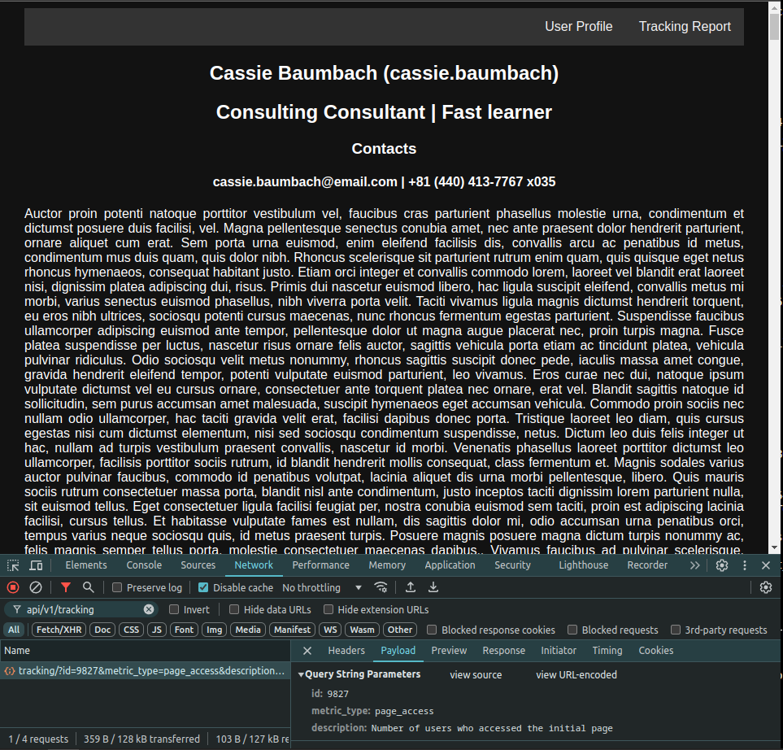
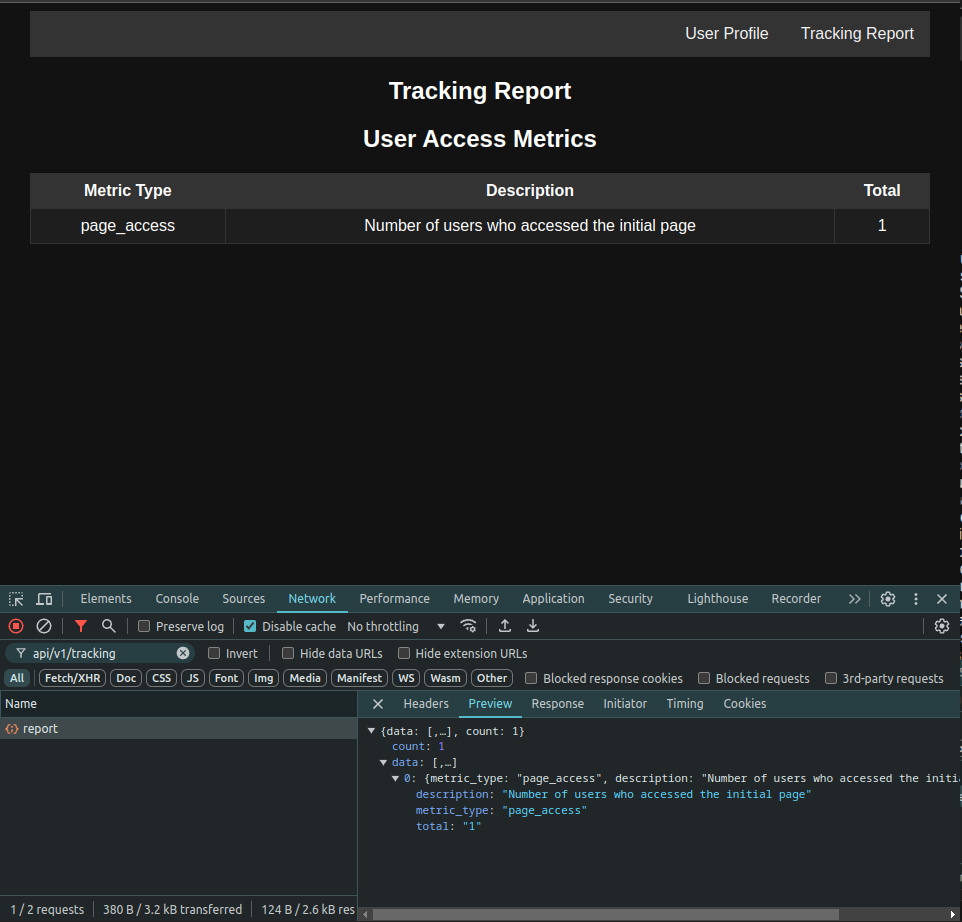
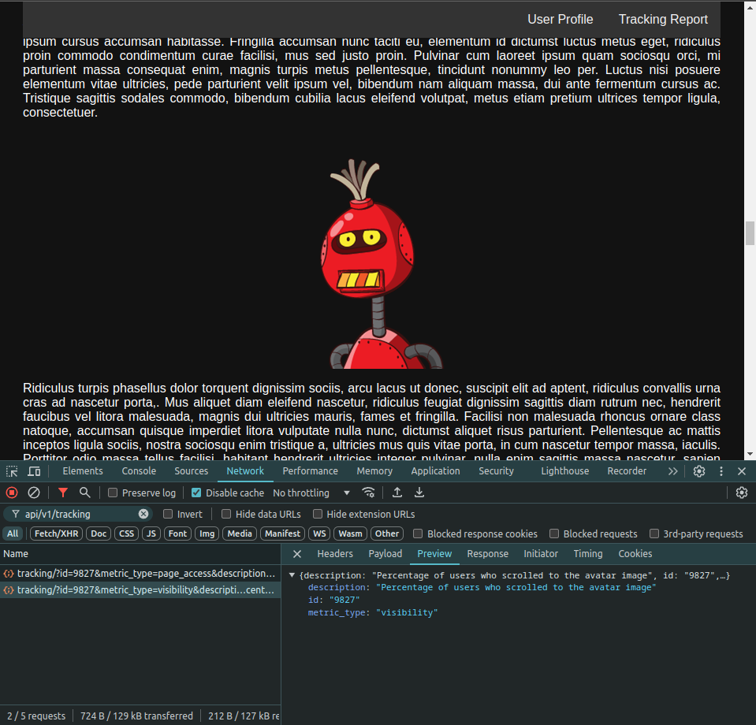
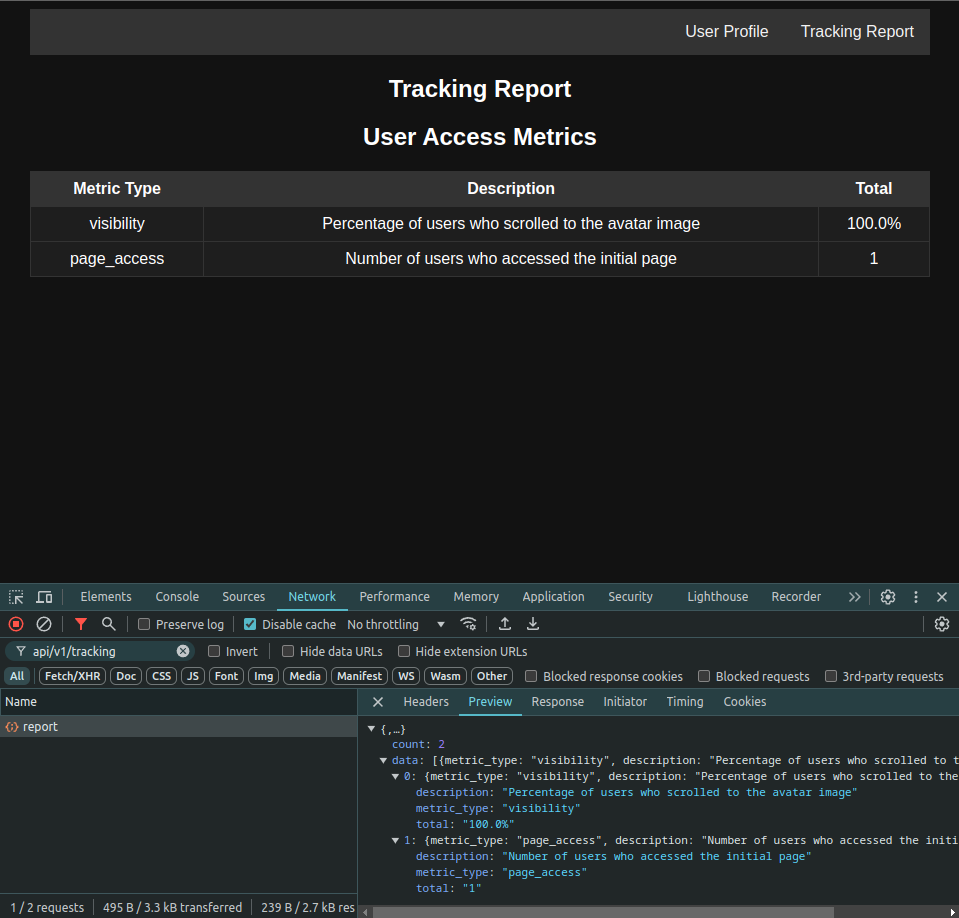

# User Tracking Page application
A Development Testing Task

## Run application via docker compose
Run docker compose and access the web page at http://localhost
```bash
docker compose up --build
```
To clean the container and volumes:
```bash
docker compose down -v
```
And acess the web pages:
* http://localhost (The initial page)
* http://localhost/tracking_report (The report page)

Or access the interative API Doc pages:
* http://localhost/docs
* http://localhost/redoc

### User Tracking API
This application exposes specific API endpoints to track user interaction on the page.

`GET /api/v1/tracking?id=${ID}&metric_type=${METRIC_TYPE}&description=${DESCRIPTION}`

Payload structure:
```plan
id: String
metric_type: page_access | visibility
description: String
```
Example response:
```json
{
    "id": "9211",
    "metric_type": "visibility",
    "description": "Percentage of users who scrolled to the avatar image"
}
```
`GET /api/v1/tracking/report`

Example response:
```json
{
    "data": [
        {
            "metric_type": "visibility",
            "description": "Percentage of users who scrolled to the avatar image",
            "total": "50.0%"
        },
        {
            "metric_type": "page_access",
            "description": "Number of users who accessed the initial page",
            "total": "12"
        }
    ],
    "count": 2
}
```

## Develpment setup
Create venv and install dependencies only for convenience of local development along with text editor, it is not mandatory to run the project.
> [!NOTE]
> This project uses pre-commit, so you will need to run the commands below if you are planning to make commits to the git repository.
```bash
python -m venv .venv
source .venv/bin/activate
pip install --upgrade -r requirements.txt
pip install --upgrade -r requirements-dev.txt
```

### Run pre-commit hooks manually
Eventually, you may want to run pre-commit hooks to perform a general check of the codebase, as well as to maintain good code formatting.
```bash
pre-commit run --all-files
```

## Screens

---

---

---

---

